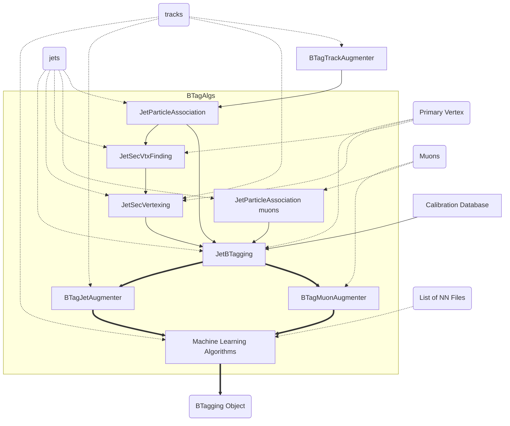

This is a rough sketch of how information flows through the b-tagging code. Little boxes are algorithms, and the dotted lines indicate where some information needs to be passed into them. Solid lines indicate objects that are created internally. In the solid line case, the name of the object has to be synchronized between algorithms. The `BTagging` object follows the thick black line.

Many of the functions to configure the above can be found in this
package, with `Cfg` appended to the name. In particular, the main
function here is `BTagAlgsCfg`, which can be found in
[BTagRun3Config](python/BTagRun3Config.py).
