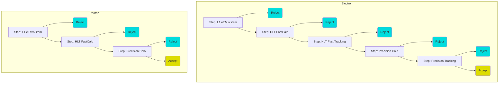

Overview of Electron and Photon Trigger chains
====

Electron and Photon trigger chains  are structured as a sequence of *steps*, where each step can contain *reconstruction* & *hypothesis* elements, so as to allow for early rejection of uninteresting events.

Main difference between electron and photon chains is, tracking is NOT used for photon reconstruction or identification at HLT. Therefore no photon conversion classification is possible online. 

The steps that are defined in electron and photon trigger chains are depicted below:

Each of the steps consist on a sequence of reconstruction algorithms ('RecoAlgs') and a Hypothesis algorithm (`HypoAlg`).
The reconstruction sequence is responsible for generating the objects or "Features" to be selected on and the Hypothesis is responsible of applying a selection cut on them. 
The `HypoAlg` may contain one or more `HypoTools, each of which represents a different selection.

The details of which algorithm run on which steps, please reffer to the [Photon](../Photon/) and [Electron](../Electron/) README files in this repository.

Modules in this directory
=====

* [GenerateElectronChainDefs](GenerateElectronChainDefs.py), [GeneratePhotonChainDefs](GeneratePhotonChainDefs.py)
  * Called by the menu code to pass the chain dict into the ChainConfiguration object
* [ElectronChainConfiguration](ElectronChainConfiguration.py), [PhotonChainConfiguration](PhotonChainConfiguration.py)
  * Defines the ChainConfiguration object that interprets the chain dict and builds the chain
* [ElectronMenuSequences](ElectronMenuSequences.py), [PhotonMenuSequences](PhotonMenuSequences.py)
  * Defines the top-level sequences containing the input maker and hypothesis alg
* [PrecisionCaloMenuSequences.py](PrecisionCaloMenuSequences.py)
  * Assembles the menu sequence for the precision calo reconstruction step
* [PrecisionTrackingMenuSequences.py](PrecisionTrackingMenuSequences.py)
  * Assembles the menu sequence for the precision track reconstruction step
* [PrecisionElectronMenuSequences.py](PrecisionElectronMenuSequences.py)
  * Assembles the menu sequence for the precision electron reconstruction step
* [PrecisionElectronMenuSequences_GSF.py](PrecisionElectronMenuSequences_GSF.py)
  * Assembles the menu sequence for the precision electron reconstruction step with Gaussian Sum Filter tracks
* [TrigEgammaDefs](TrigEgammaDefs.py)
  * Common definitions
* [TrigEgammaKeys](TrigEgammaKeys.py)
  * Configuration of container names for HLT electrons, HLT photons and identification working points for Cut=Based selection, likelihood, Dnn and Ringer
* [TrigEgammaFactories](TrigEgammaFactories.py)
  * ToolFactories to configure common TrigEgamma Tools
