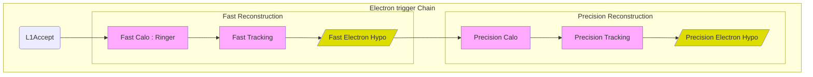
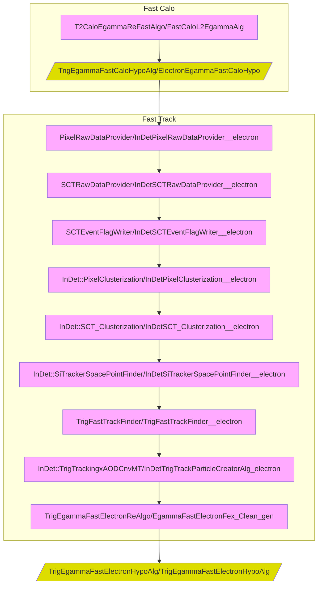
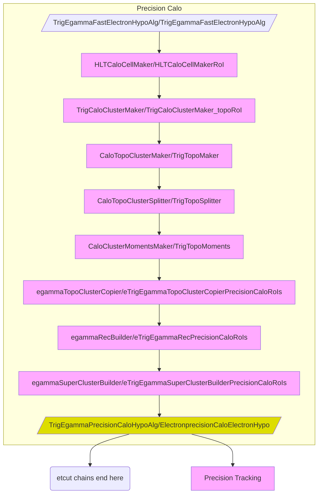
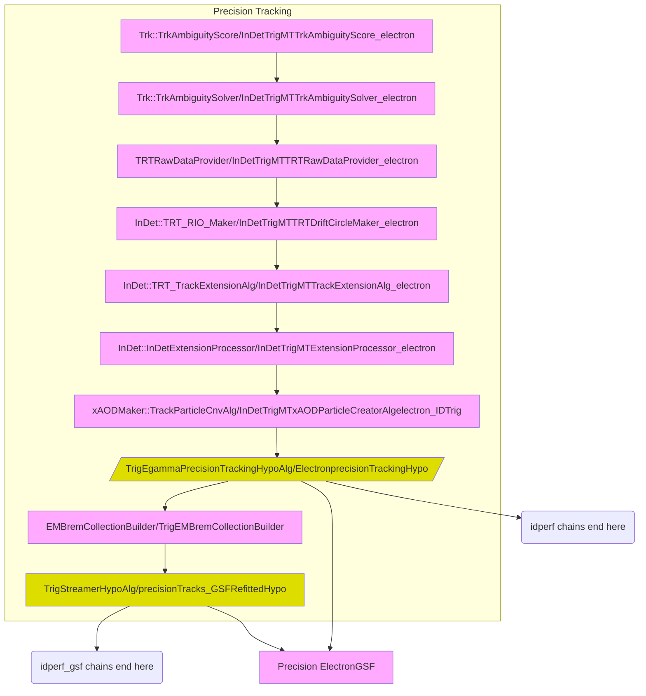

Electron trigger chains
=====

This folder contains all the configuration of electron trigger chains. Any code common or shared with Electrons are available in the [Egamma](../Egamma) folder.
Electron triggers are implemented as a sequence of feature extraction and hypothesis testing steps. First selection is performed at The Level 1 (L1).
If L1 accepts the event, then it passes to the HLT the Regions of interest (RoIs) and their type (for us here EM type of RoI). 

The HLT will perform the reconstruction and identification of online electrons first doing a fast reconstruction and then a precision reconstruction.



In more details, the algorithm and its instances running at each step are represented below. As Electron chains have many steps and many algorithms, below you will find one diagram for the Fast reconstruction and another for the Precision reconstruction:


## Fast Electron Reconstruction




## Precision Electron Reconstruction

We currently have two flavours/variants of Electron reconstruction at HLT. One default variant without any refit of the tracks at precision step, and another *with* track refiting using Gaussian Sum Filter refit.

### Precision Calo for Electrons
The algorithm sequence of Precision Calo for electrons is the same as for Photons. Precision Calo electrons seeds the precision Tracking part of the chain and also provides the electron ```etcut``` chains.



### Precision Tracking

Precision tracking is instnaciated after Precision Calo electron part of the chain. ITs run within the Electron RoI and tracks are matched to the cluster in the previous step. Precision Tracking seeds Precision Electron reconstruction at the HLT and also provides idperf chains. 

GSF refitting of the track is new and will be used online for the first time in Run3. For commissioning and comparing w.r.t. Run2 we still provide and support non-GSF refitted tracks/electrons too




### Precision Electron
Precision electrons at HLT are ```xAOD::Electron``` objects made by ```xAODEgammaBuilder``` algorithm combining clusters from the Precision Calo electron stage and tracks from Precision Tracking. In Run2 tracks were not reffited for Brem recovery at HLT. Although by default we do Gaussian Sum Filter (GSF) to reffit tracks for Brem recovery in Run3, we still support electron Trigger Chains built from  nonGSF reffitted traks.

In precision Electron step both flavours are identical, although the name of the alg instances have a different suffix (```noGSF``` or ```GSFRefit```) depending on the case.

```mermaid
graph TD;



 subgraph Precision Electron nonGSF


egammaRecBuildere[egammaRecBuilder/TrigEgammaRecElectron_noGSF]:::alg
egammaRecBuildere --> electronSuperClusterBuilder[electronSuperClusterBuilder/TrigElectronSuperClusterBuilder_noGSF]:::alg
electronSuperClusterBuilder --> xAODEgammaBuilder[xAODEgammaBuilder/TrigTopoEgammaElectronCfg_noGSF]:::alg
xAODEgammaBuilder --> IsolationBuilder[IsolationBuilder/TrigElectronIsoBuilderCfg_noGSF]:::alg
IsolationBuilder --> TrigEgammaPrecisionElectronHypoAlg[TrigEgammaPrecisionElectronHypoAlg/TrigEgammaprecisionElectronHypoAlg_noGSF]:::hypo
 end

  classDef hypo fill:#dd0;
  classDef alg fill:#faf;
```




Precision Electrons at HLT in Run3 by default are reconstructed combining GSF-reffited tracks and superclusters. 

```mermaid
graph TD;

 subgraph Precision GSF Electron

egammaRecBuilderGSF[egammaRecBuilder/TrigEgammaRecElectron_GSFRefit]:::alg
egammaRecBuilderGSF --> electronSuperClusterBuilderGSF[electronSuperClusterBuilder/TrigElectronSuperClusterBuilder_GSFRefit]:::alg
electronSuperClusterBuilderGSF --> xAODEgammaBuilderGSF[xAODEgammaBuilder/TrigTopoEgammaElectronCfg_GSFRefit]:::alg
xAODEgammaBuilderGSF --> IsolationBuilderGSF[IsolationBuilder/TrigElectronIsoBuilderCfg_GSFRefit]:::alg
IsolationBuilderGSF --> TrigEgammaPrecisionElectronHypoAlgGSF[TrigEgammaPrecisionElectronHypoAlg/TrigEgammaprecisionElectronHypoAlg_GSFRefit]:::hypo

 end


  classDef hypo fill:#dd0;
  classDef alg fill:#faf;


```



Modules in this directory
-----

* [TrigElectronFactories](TrigElectronFactories.py)
  * ToolFactories to configure egammaAlgs to be used at the HLT
* [ElectronRecoSequences](ElectronRecoSequences.py)
  * Assembles the sequences for fast reconstruction
* [PrecisionElectronRecoSequences](PrecisionElectronRecoSequences.py)
  * Assembles the sequences for precision reconstruction
* [PrecisionElectronRecoSequences_GSF](PrecisionElectronRecoSequences_GSF.py)
  * Assembles the sequences for precision reconstruction with Gaussian Sum Filter tracks
* [TrigEMBremCollectionBuilder](TrigEMBremCollectionBuilder.py)
  * ToolFactory to instantiate TrigEMBremCollectionBuilder with default configuration
* [generateElectron](generateElectron.py)
  * Prototype for NewJO chain configuration
