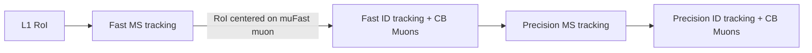
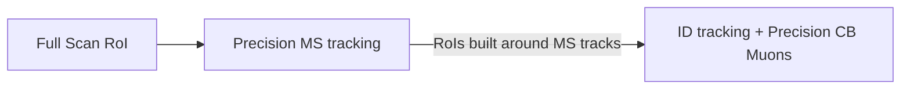

Muon Trigger Overview
-----

The muon trigger runs in two main modes: RoI based and Full scan.

The primary RoI mode start from a L1 muon RoI and runs the following steps: 
1. Fast Muon Spectrometer (MS) tracking
2. Fast ID tracking + Fast MS-ID combination
3. Precision MS tracking
4. Precision ID tracking + precision MS-ID combination

There are several variations on this, such as adding isolation or invariant mass cuts after step 4, or running only the MS track building.

The full scan mode runs in two steps:
1. The precision MS tracking runs in the full detector
2. The ID tracking and precision ID MS-ID combination runs in RoIs centered on the MS tracks created in step 1.

Typically, the full scan muon trigger runs as part of a multi-muon trigger, where the first muon is found in a RoI (to reduce CPU usage).

Variations of Muon Triggers
-----

* noL1: full scan muon
  * nscan: Require final muons to be within dR=0.5 of each other
* msonly: only run SA muon reconstruction
  * 3layersEC: apply requirement of hits in 3 layers of MS in endcaps
* lateMu: Run late muon reconstruction to find muons in next bunch crossing
* l2io: Run inside-out reconstruction for muFast (to recover close-by muons)
* l2mt: Run multi-track reconstruction for muFast (to recover close-by muons)
* 0eta105: |eta| less than 1.05 (barrel only)
* muoncalib: Runs only muFast for muon calibration
* LRT: run large radius tracking
  * d0loose/medium/tight: apply cut on d0 of muons
* muonqual: apply some muon quality requirements to final combined muons
* idperf: Runs usual reconstruction but don't cut on anything that requires ID track information (used for ID performance)
* invm: apply invariant mass cut
  * os: require muons in invariant mass calculation to have opposite sign
* cosmic: purely a label for cosmic triggers in the menu. Does not have any impact on reconctruction

Modules in this directory
-----

* [GenerateMuonChainDefs](GenerateMuonChainDefs.py)
  * Called by the menu code to pass the chain dict into the ChainConfiguration object
* [MuonChainConfiguration](MuonChainConfiguration.py)
  * Defines the ChainConfiguration object that interprets the chain dict and builds the chain
* [MuonMenuSequences](MuonMenuSequences.py)
  * Defines the top-level sequences containing the input maker and hypothesis alg
  * For more descriptions of the various sequences, see [SequenceOverview](docs/SequenceOverview.md)
* [MuonRecoSequences](MuonRecoSequences.py)
  * Assembles the sequences for each stage of reconstruction
  * For more information on the algorithms, see [MuonTriggerDocumentation](https://twiki.cern.ch/twiki/bin/view/Atlas/MuonTriggerDocumentation)
* [generateMuon](generateMuon.py)
  * NewJO chain configuration

