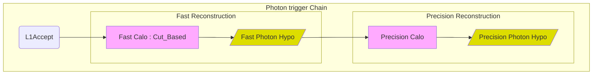
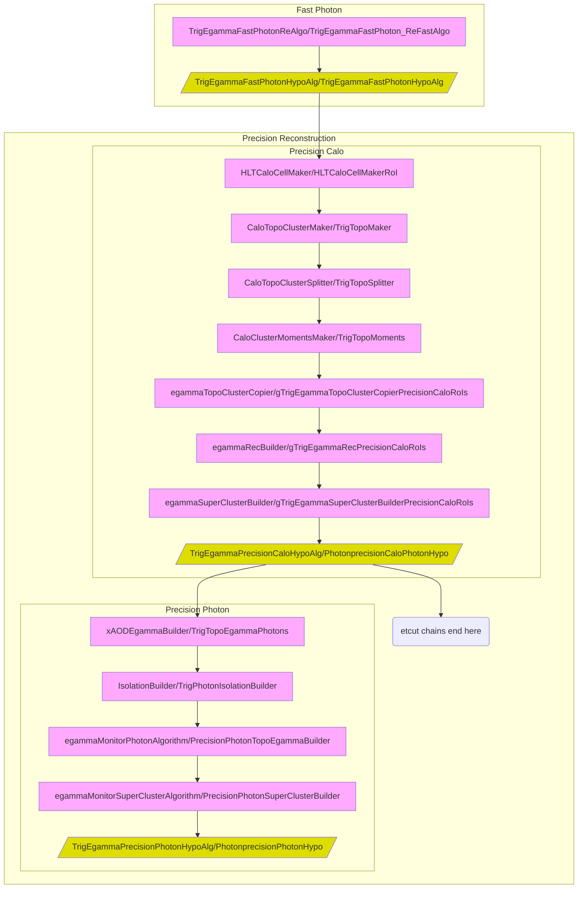

Photon trigger chains
=====

This folder contains all the configuration of photon trigger chains. Any code common or shared with Electrons are available in the [Egamma](../Egamma) folder.
Photon triggers are implemented as a sequence of feature extraction and hypothesis testing steps. First selection is performed at The Level 1 (L1).
If L1 accepts the event, then it passes to the HLT the Regions of interest (RoIs) and their type (for us here EM type of RoI). 

The HLT will perform the identification of photons 

In more details, the algorithm and its instances running at each step are represented below:

Modules in this directory
-----

* [TrigPhotonFactories](TrigPhotonFactories.py)
  * ToolFactories to configure egammaAlgs to be used at the HLT
* [PhotonRecoSequences](PhotonRecoSequences.py)
  * Assembles the sequences for each stage of reconstruction
* [generatePhoton](generatePhoton.py)
  * Prototype for NewJO chain configuration
