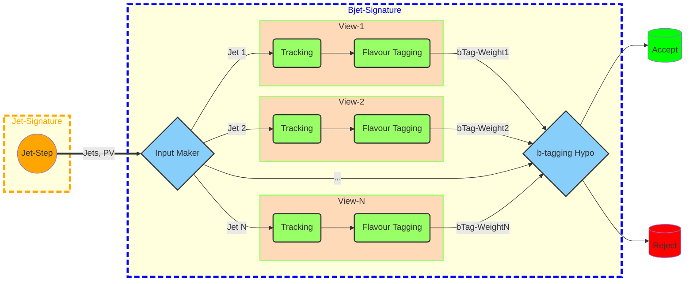
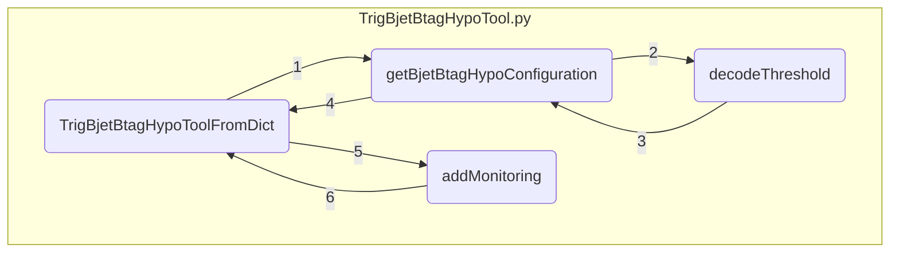

<!--Copyright (C) 2002-2021 CERN for the benefit of the ATLAS collaboration-->

# Bjet Trigger configuration guide

This document is intended to describe the bjet-signature specific code. Besides a general explanation on the code workflow, there will be a tangible example using the bjet chain '*HLT_2j55_0eta290_020jvt_pf_ftf_bdl1r60_2j55_pf_ftf_0eta320_L14J15p0ETA25*'.

[[_TOC_]]

## TriggerMenuMT
The starting point for each trigger is the chain-name, a simple string. In our example it is  '*HLT_2j55_0eta290_020jvt_pf_ftf_bdl1r60_2j55_pf_ftf_0eta320_L14J15p0ETA25*'. In [Trigger Menu](https://gitlab.cern.ch/atlas/athena/-/tree/master/Trigger/TriggerCommon/TriggerMenuMT/python/HLTMenuConfig/Menu) this string is getting converted into a python-dictionary. This dictionary contains sub-dictionaries for each chain part. These sub-dictionaries are signature specific and contain all information needed for the execution of the signature code.
The chain parts in the chain-name are identified by the trigger types.
</details>
<details>
<summary> Click here to see the full list of slice identifiers</summary>

| Slice        | Identifier|
| ------------ | --------- |
| Electron     | e         |
| Jet          | j         |
| HT           | ht        |
| Photon       | g         |
| Muon         | mu        |
| Tau          | tau       |
| MET          | xe        |
| XS           | xs        |
| TE           | te        |
| AFP          | afp       |
| MinBias      | mb        |
| HeavyIon     | hi        |
| Cosmic       | cosmic    |
| Calibration  | calib     |
| Streaming    | streamer  |
| Monitoring   | mon       |
| Beamspot     | beamspot  |
| EnhancedBias | eb        |
| Test         | TestChain |

</details>
In our example chain there are two chain parts '*2j55_0eta290_020jvt_pf_ftf_bdl1r60*' and '*2j55_pf_ftf_0eta320_L14J15p0ETA25*'.

Before the b-tagging weight of a jet can be calculated, the jet itself has to be reconstructed first. Hence, the first step in each bjet-chain is always the execution of jet-signature code. Because of the close relation between the two signatures, they both share the common chain part identifier '*j*' and chain part (sub-)dictionary JetChainParts-Dictionary.

This is only a brief introduction to the trigger menu in order to better understand the structure of the signature code below. For more informations on the trigger menu consult [Trigger Developers Guide](https://atlassoftwaredocs.web.cern.ch/guides/trigger/).


## JetChainParts-Dictionary
The ChainParts-Dictionaries are defined in [SignatureDicts.py](https://gitlab.cern.ch/atlas/athena/-/blob/master/Trigger/TriggerCommon/TriggerMenuMT/python/HLTMenuConfig/Menu/SignatureDicts.py). There you can also find the full set of keys and defaults of the JetChainParts-Dictionary. The b-tagging specific options are listed in the table below:

| Key           | Description                   | Allowed values | Default       |
| --------------| ------------------------------| ---------------| --------------|
| bTag          | b-tagging working point       | boffperf (no bTag cut) <br> bmv2c20*, bmv2c10*, bhmv2c10* (\*=40,50,60,70,77,85) <br> bdl1r* (\*=60,70,77,85)| ''|
| bTracking     |                               |''              | ''|
| bConfig       |                               | split          | []|
| bMatching     |                               |antimatchdr05mu | []|             

Important to note is that for b-jets a default cut of $`|\eta| < 2.9`$ is applied, since tracking can be run only up to $`\eta=2.5`$.\
If the option '*bTag*' is set, the corresponding b-tagging algorithms will be executed.

For the chain '*HLT_2j55_0eta290_020jvt_pf_ftf_bdl1r60_2j55_pf_ftf_0eta320_L14J15p0ETA25*' the complete chain dictionary would be:

</details>
<details>
<summary> Click here to expand</summary>

```python
[   {   'EBstep': '',
         'L1item': 'L1_4J15p0ETA25',
         'alignmentGroups': ['JetMET', 'JetMET'],
         'chainCounter': 90,
         'chainMultiplicities': [2, 2],
         'chainName': 'HLT_2j55_0eta290_020jvt_pf_ftf_bdl1r60_2j55_pf_ftf_0eta320_L14J15p0ETA25',
         'chainNameHash': 2773148884,
         'chainParts': [   {   'L1threshold': 'FSNOSEED',
                               'addInfo': [],
                               'alignmentGroup': 'JetMET',
                               'bConfig': [],
                               'bMatching': [],
                               'bTag': 'bdl1r60',
                               'bTracking': '',
                               'chainPartIndex': 0,
                               'chainPartName': '2j55_0eta290_020jvt_pf_ftf_bdl1r60',
                               'clusterCalib': 'em',
                               'constitMod': '',
                               'constitType': 'pf',
                               'etaRange': '0eta290',
                               'exotHypo': [],
                               'extra': '',
                               'hypoScenario': 'simple',
                               'jetCalib': 'default',
                               'jvt': '020jvt',
                               'momCuts': '',
                               'multiplicity': '2',
                               'prefilters': [],
                               'recoAlg': 'a4',
                               'scan': 'FS',
                               'sigFolder': 'Jet',
                               'signature': 'Bjet',
                               'smc': 'nosmc',
                               'subSigs': ['Jet'],
                               'tboundary': '',
                               'threshold': '55',
                               'topo': [],
                               'trigType': 'j',
                               'trkopt': 'ftf',
                               'trkpresel': 'nopresel'},
                           {   'L1threshold': 'FSNOSEED',
                               'addInfo': [],
                               'alignmentGroup': 'JetMET',
                               'bConfig': [],
                               'bMatching': [],
                               'bTag': '',
                               'bTracking': '',
                               'chainPartIndex': 0,
                               'chainPartName': '2j55_pf_ftf_0eta320',
                               'clusterCalib': 'em',
                               'constitMod': '',
                               'constitType': 'pf',
                               'etaRange': '0eta320',
                               'exotHypo': [],
                               'extra': '',
                               'hypoScenario': 'simple',
                               'jetCalib': 'default',
                               'jvt': '',
                               'momCuts': '',
                               'multiplicity': '2',
                               'prefilters': [],
                               'recoAlg': 'a4',
                               'scan': 'FS',
                               'sigFolder': 'Jet',
                               'signature': 'Jet',
                               'smc': 'nosmc',
                               'subSigs': ['Jet'],
                               'tboundary': '',
                               'threshold': '55',
                               'topo': [],
                               'trigType': 'j',
                               'trkopt': 'ftf',
                               'trkpresel': 'nopresel'}],
         'eventBuildType': '',
         'extraComboHypos': [],
         'groups': ['Primary:Legacy', 'RATE:MultiBJet', 'BW:BJet'],
         'mergingOffset': -1,
         'mergingOrder': [],
         'mergingStrategy': 'auto',
         'monGroups': [],
         'prescale': 1,
         'sigFolder': '',
         'signature': 'Bjet',
         'signatures': ['Bjet', 'Jet'],
         'stream': ['Main'],
         'subSigs': [],
         'topo': [],
         'topoStartFrom': False}]
```
</details>

Under '*chainParts*' it contains two JetChainParts-Dictionaries, one for each of the jet chain parts '*2j55_0eta290_020jvt_pf_ftf_bdl1r60*' and '*2j55_pf_ftf_0eta320_L14J15p0ETA25*'.
This dictionary serves as input to the bjet-signature code.

## Bjet-signature code
The bjet-signature code is hosted [here](https://gitlab.cern.ch/atlas/athena/-/tree/master/Trigger/TriggerCommon/TriggerMenuMT/python/HLTMenuConfig/Bjet). The following graph should give an overview of the general workflow.



The following list will describe the available files and their functionality:
1. [GenerateBjetChainDefs.py](https://gitlab.cern.ch/atlas/athena/-/blob/master/Trigger/TriggerCommon/TriggerMenuMT/python/HLTMenuConfig/Bjet/GenerateBjetChainDefs.py)\
     The first function being called in every signature code is '*generateChainConfigs*'. For the bjet-signature this function is located in '*GenerateBjetChainDefs.py*'. Input to it is the complete chain dictionary (see above for our example).\
     In a first stept this dictionary is being split into a list of chain dictionaries, one for each chain part, i.e. in the end each dictionary contains only one chain part.
     ```python
      listOfChainDicts = splitChainDict(chainDict)
     ```
     In this way the following reconstruction code can be run separately for each chain part. This is done because b-tagging has not to be calculated for all chain parts.\
     The code then loops over the list of dictionaries
     ```python
      for subChainDict in listOfChainDicts:
     ```
     , assembles the chain
     ```python
      jet = JetChainConfiguration(chainDict).assembleChain()
     ```
     and checks whether the signature is `Bjet` or `Jet`, i.e. whether `bTag` option is set or not.\
     If the signature is '*Jet*', the chain consists only of jet-code ('*JetChainConfiguration*').
     ```python
      if subChainDict['chainParts'][0]['signature'] != 'Bjet':
      listOfChainDefs += [jet]
     ```
     If the signature is '*Bjet*', also bjet-code ('*BjetChainConfiguration*') is added to the chain
     ```python
      Bjet = BjetChainConfiguration(subChainDict, jet).assembleChain() 
      jet.steps = jet.steps + Bjet.steps
      listOfChainDefs += [jet]
     ```
     As a last step all chains, from each chain part, are being merged into one chain.
     ```python
      theBjetChainDef = mergeChainDefs(listOfChainDefs, chainDict)
     ```
     This final chain then corresponds again to the complete chain dictionary which has been passed to '*generateChainConfigs*', and is being returned.\
     For our example we can read of the chain parts and signatures from the dictionary above:

    | chain part                         | Signature | Steps to be executed |
    |------------------------------------|-----------|----------------------|
    | 2j55_0eta290_020jvt_pf_ftf_bdl1r60 | Bjet      | Jet + Bjet           |
    | 2j55_pf_ftf_0eta320_L14J15p0ETA25  | Jet       | Jet                  |

2. [JetChainConfiguration.py](https://gitlab.cern.ch/atlas/athena/-/blob/master/Trigger/TriggerCommon/TriggerMenuMT/python/HLTMenuConfig/Jet/JetChainConfiguration.py) \& [BjetChainConfiguration.py](https://gitlab.cern.ch/atlas/athena/-/blob/master/Trigger/TriggerCommon/TriggerMenuMT/python/HLTMenuConfig/Bjet/BjetChainConfiguration.py)\
     Those two files are being called by '*GenerateBjetChainDefs.py*'. Input are the chain dictionaries with only one chain part, created in `GenerateBjetChainDefs.py`. They interpret the chain dict and build the chain for jet reconstruction and b-tagging, respectively. For details on the jet reconstruction please consult the respective documentation. Here we will focus on the b-tagging code.\
In '*BjetChainConfiguration.py*' the bjet sequence is added as one step of the chain part steps. The sequence is extracted from `getBJetSequence`, which is defined in '*BjetMenuSequence*'.
     ```python
      stepName = f"Step2_{self.jc_name}_bjet"
      chainSteps = [self.getStep(2, stepName, [bjetSequenceCfg])]
     ```
     Based on these steps the chain is being build
     ```python
      myChain = self.buildChain(chainSteps)
     ```
     and finally returned.\
     In the log-files this step can be recognised by its name "Step2_bjet". It is called "Step2" as the first step is the jet-reconstruction.

3. [BjetMenuSequence](https://gitlab.cern.ch/atlas/athena/-/blob/master/Trigger/TriggerCommon/TriggerMenuMT/python/HLTMenuConfig/Bjet/BjetMenuSequences.py)\
     This file assembles all reconstruction algorithms into the bjet sequence mentioned above. As input it requires only the name of the jet-collection. In this way the code can be run for "EMTopo" and "EMPFlow" jet-collections. In the end a '*MenuSequence*' is being returned. A '*MenuSequence*' consits of three parts: '*InputMaker*', '*Sequence*' and '*Hypo*'.
    - **InputMaker**\
      The **InputMaker** defines the environement in which the **sequence** will be executed.\
      At first an event view is being created for every Region-of-Interest (RoI, `outputRoIName = getInDetTrigConfig('bjet').roi`, currently "HLT_Roi_Bjet")
      ```python
        InputMakerAlg = EventViewCreatorAlgorithm( "IMBJet_{jc_name}_step2" )
      ```
      In our case the RoIs are the jets. Consequently a plane in $`\eta-\phi`$ around the jet axis will be cut out and put into a single event view
      ```python
        RoITool = ViewCreatorCentredOnJetWithPVConstraintROITool()
      ```
      Currently the default values of $`\eta (\text{half-width}) = \phi (\text{half-width}) = 0.4`$ are being used (cf. [ViewCreatorCentredOnJetWithPVConstraintROITool.h](https://gitlab.cern.ch/atlas/athena/-/blob/master/Trigger/TrigSteer/DecisionHandling/src/ViewCreatorCentredOnJetWithPVConstraintROITool.h)). Hence, the total size will be $`0.8 \times 0.8`$. The event views allow us to process only the most relevant parts of the detector information and thereby speed up the computation time. In addition a constraint on the distance between jet and primary vertex of $`z < 10 mm`$ is applied when creating the view.\
      The primary vertex (PV) has already been determined by the jet code upstream. The collection name is configured from [TrigInDetConfig/ConfigSettings.py](https://gitlab.cern.ch/atlas/athena/-/blob/master/Trigger/TrigTools/TrigInDetConfig/python/ConfigSettings.py), currently being `HLT_IDVertex_FS`  
      ```python
       config=getInDetTrigConfig('jet')
       prmVtxKey = config.vertex
      ```
      The vertex-collection is attached to the RoI
      ```python
        VertexReadHandleKey = prmVtxKey,
        PrmVtxLink = prmVtxKey.replace( "HLT_","" ),
      ```
      It is read from outside of the event view. Hence, the option 
      ```python
        ViewFallThrough = True
      ```
      is set.\
      In contrast, for the jet-collection a deep-copy of it is placed inside the view (cf. [EventViewCreatorAlgorithm.cxx](https://gitlab.cern.ch/atlas/athena/-/blob/master/Trigger/TrigSteer/ViewAlgs/src/EventViewCreatorAlgorithm.cxx)), since it will be modified inside the view.
      ```python
        PlaceJetInView = True
      ```
      The name of the jet-collection inside the view is
      ```python
        InViewJets = recordable( f'HLT_{jc_key}bJets' )
      ```
      At this point all of our inputs are defined and accessible inside the view. Though important to remember is that all collections inside the view have to be defined in [TriggerEDMRun3.py](https://gitlab.cern.ch/atlas/athena/-/blob/BjetDoc/Trigger/TriggerCommon/TrigEDMConfig/python/TriggerEDMRun3.py) with the respective '*inViews*'-name, here
      ```python
        Views = f"BTagViews_{jc_name}"
      ```
      in order to be saved.
    - **Sequence**\
      The **sequence** is a sequence of all algorithms that will be executed with extra informations on it's ordering, i.e. which algorithms can be run in parallel and which have to be run sequential. All algorithms in our sequence are being run inside the single event views.\
      The first algorithms are second stage of fast tracking and precision tracking (see [BjetTrackingConfiguration.py](https://gitlab.cern.ch/atlas/athena/-/blob/master/Trigger/TriggerCommon/TriggerMenuMT/python/HLTMenuConfig/Bjet/BjetTrackingConfiguration.py)).
      ```python
        secondStageAlgs, PTTrackParticles = getSecondStageBjetTracking(
          inputRoI=InputMakerAlg.InViewRoIs,
          inputVertex=prmVtxKey,
          inputJets=InputMakerAlg.InViewJets
        )
      ```
      '*secondStageAlgs*' and '*PTTrackParticles*' are the sequences of tracking algorithms which produces the final precision-track particle-collections.\
      Afterwards flavour-tagging algorithms are executed. This code is written in new-style format, so the configuration has to be adapted correspondingly
      ```python
        from AthenaCommon.Configurable import ConfigurableRun3Behavior
        with ConfigurableRun3Behavior():
      ```
      Then we can extract the sequence of flavour-tagging algorithms from '*getFlavourTagging*' (see [BjetFlavourTaggingConfiguration.py](https://gitlab.cern.ch/atlas/athena/-/blob/master/Trigger/TriggerCommon/TriggerMenuMT/python/HLTMenuConfig/Bjet/BjetFlavourTaggingConfiguration.py))
      ```python
        acc_flavourTaggingAlgs = getFlavourTagging(
            inputJets=str(InputMakerAlg.InViewJets),
            inputVertex=prmVtxKey,
            inputTracks=PTTrackParticles[0],
            BTagName=BTagName,
            inputMuons=None
        )
      ```
      The '*Trackparticles*' together with the '*Jets*' and '*Primary Vertex*' serve as inputs (Muons are not supported, yet.).\
      In a next step the flavour-tagging algorithms are converted back to old-style format, since the rest of the code is in old-style format, too. To do so the algorithms are being extracted from the '*ComponentAccumulator*' and reconfigured.
      Parts of the ComponentAccumulator "acc_flavourTaggingAlgs" that aren't algorithms, e.g. conditionsAlgs, are added to athena separately.\
      Finally the tracking and flavour-tagging sequence are merged into one sequence.
      ```python
        bJetBtagSequence = seqAND( f"bJetBtagSequence_{jc_name}", secondStageAlgs + flavourTaggingAlgs )
      ```
      They are merged sequentially ('*seqAND*'), since flavour-tagging needs the trackparticle-collection as an input.\
      For a similar reason **InputMaker** and the above sequence are merged sequentially, too
      ```python
        BjetAthSequence = seqAND( f"BjetAthSequence_{jc_name}_step2",[InputMakerAlg,bJetBtagSequence] )
      ```
      This is the final sequence being given to '*MenuSequence*'.
    - **Hypo**\
      The **hypo** algorithm tests whether a given hypothesis is `True` or `False`. For the bjet signature it tests whether the chain fulfills the given b-tagging requirements.\
      The algorithm for this (see [TrigBjetBtagHypoAlg.cxx](https://gitlab.cern.ch/atlas/athena/-/blob/master/Trigger/TrigHypothesis/TrigBjetHypo/src/TrigBjetBtagHypoAlg.cxx)) is loaded via
      ```python
        hypo = TrigBjetBtagHypoAlg(
         f"TrigBjetBtagHypoAlg_{jc_name}",
         # keys
         BTaggedJetKey = InputMakerAlg.InViewJets,
         BTaggingKey = BTagName,
         TracksKey = PTTrackParticles[0],
         PrmVtxKey = InputMakerAlg.RoITool.VertexReadHandleKey,
         # links for navigation
         BTaggingLink = BTagName.replace( "HLT_","" ),
         PrmVtxLink = InputMakerAlg.RoITool.PrmVtxLink,
         MonTool = TrigBjetOnlineMonitoring()
       )
      ```
      The inputs to it are the names of the jet, b-Tagging, tracks and PV collections.\
      The hypo-algorithms retrive the collections from the view. For this reason online monitoring is being performed at this instance (see [TrigBjetMonitoringConfig.py](https://gitlab.cern.ch/atlas/athena/-/blob/master/Trigger/TrigHypothesis/TrigBjetHypo/python/TrigBjetMonitoringConfig.py)).\
      In the end the hypothesis is being tested with the help of the hypotool (see [TrigBjetBtagHypoTool.py](https://gitlab.cern.ch/atlas/athena/-/blob/master/Trigger/TrigHypothesis/TrigBjetHypo/python/TrigBjetBtagHypoTool.py))
      ```python
        from TrigBjetHypo.TrigBjetBtagHypoTool import TrigBjetBtagHypoToolFromDict
      ```
      This is being set up based on the input chain directory.

      For our example chain this means that if we have 2 jets with $`E_{\text{T}}` > 55 \text{GeV}$, $`|\eta|<2.9`$, $`\text{jvt} > 0.2`$ that are passing the 60% DL1r working point, i.e. $`\text{DL1r} > 4.31`$ (this is what we have in hypo but im pretty sure this is not the most up to date one) (`j55_0eta290_020jvt_pf_ftf_bdl1r60`) and 2 additional jets with $`E_{\text{T}}` > 55 \text{GeV}$ and $`|\eta|< 3.2`$, the hypothesis is true, the chain is passed and the event will be saved.\
      Since this chain has a multiplicity of greater than 1, this is being interpreted by the '*ComboHypo*', which will be explained in more detail in the next section.

      The complete '*MenuSequence*' then looks as follows
      ```python
        return MenuSequence( Sequence    = BjetAthSequence,
                             Maker       = InputMakerAlg,
                             Hypo        = hypo,
                             HypoToolGen = TrigBjetBtagHypoToolFromDict)
      ```
      The name of the new b-tagging collection is
      ```python
        jc_key = f'{jc_name}_'
        BTagName = recordable(f'{jc_key}BTagging')
      ```

4. [BjetTrackingConfiguration.py](https://gitlab.cern.ch/atlas/athena/-/blob/master/Trigger/TriggerCommon/TriggerMenuMT/python/HLTMenuConfig/Bjet/BjetTrackingConfiguration.py)\
     This file configures the tracking algorithms run in the bjet signature code.\
     The function '*getSecondStageBjetTracking*' is called in '*BjetMenuSequence*'.\
     Inputs to it are the name of the RoI, PV and Jets it should run on.\
     With this setup all tracking algorithms can be executed inside the view context.\
     In case the '*Inputfile*' is not in '*bytestream*'-format, the '*TRT*' informations have to be added by hand. To make sure it is also available at whole event-level, the topSequence is loaded and the data is added
     ```python
       topSequence = AlgSequence()
       if not globalflags.InputFormat.is_bytestream():
      viewVerify.DataObjects += [( 'TRT_RDO_Container' , 'StoreGateSvc+TRT_RDOs' )]
      topSequence.SGInputLoader.Load += [( 'TRT_RDO_Container' , 'StoreGateSvc+TRT_RDOs' )]
     ```
     The first set of algorithms being added to the sequence are '*Second Stage of Fast Tracking*'
     ```python
       viewAlgs, viewVerify = makeInDetTrigFastTracking( config = IDTrigConfig, rois=inputRoI)
       algSequence.append( parOR("SecondStageFastTrackingSequence",viewAlgs) )
     ```
     The second set of algorthms being added to the sequence are '*Precision Tracking*'
     ```python
       PTTracks, PTTrackParticles, PTAlgs = makeInDetTrigPrecisionTracking( config = IDTrigConfig, rois=inputRoI )
       algSequence.append( seqAND("PrecisionTrackingSequence",PTAlgs) )
     ```
     In the end the complete sequence of tracking algorithms and the new precision track '*TrackParticle*'-Collection is being returned
     ```python
       return [ algSequence, PTTrackParticles ]
     ```
     The name of the '*TrackParticle*'-Collection is `HLT_IDTrack_Bjet_IDTrig`.\
     For more informations on the tracking algorithms you can check out the '*IDTrig*' documentations.

5. [BjetFlavourTaggingConfiguration.py](https://gitlab.cern.ch/atlas/athena/-/blob/master/Trigger/TriggerCommon/TriggerMenuMT/python/HLTMenuConfig/Bjet/BjetFlavourTaggingConfiguration.py)\
     This file configures the algorithms to compute b-tagging probabilities. The same algorithms as at offline-level are being executed, just using the respective trigger-collections. For bjet, again all algorithms are running inside the views.\
     The function '*getFlavourTagging*' is only being called in '*BjetMenuSequence*'. Inputs are track, jet, PV and output b-Tagging collection names.\
     The workflow is as follows:
     - **JetParticleAssociationAlg**
       ```python
         acc.merge(JetParticleAssociationAlgCfg(ConfigFlags, inputJets.replace("Jets",""), inputTracks, "TracksForBTagging"))
       ```
       Decorates a link to the jet container pointing towards the tracks (`HLT_IDTrack_Bjet_IDTrig`) called `HLT_{jc_key}bJets.TracksForBTagging`.
     - **Secondary Vertexing**
       ```python
         SecVertexers = [ 'JetFitter', 'SV1' ]
         for sv in SecVertexers:
             acc.merge(JetSecVtxFindingAlgCfg(ConfigFlags, inputJets.replace("Jets",""), inputVertex, sv, "TracksForBTagging"))
             acc.merge(JetSecVertexingAlgCfg(ConfigFlags, BTagName, inputJets.replace("Jets",""), inputTracks, inputVertex, sv))
       ```
       Determines the vertices for `SV1` and `JetFitter`, creates VertexContainers (`HLT_BTaggingJFVtx`, `HLT_BTaggingSecVtx`) and links them to the jets (`.JFVtx`, `.SecVtx`)
     - **JetBTaggingAlg**
       ```python
         acc.merge(JetBTaggingAlgCfg(ConfigFlags, BTaggingCollection=BTagName, JetCollection=inputJets.replace("Jets",""), PrimaryVertexCollectionName=inputVertex, TaggerList=ConfigFlags.BTagging.Run2TrigTaggers, SetupScheme="Trig", SecVertexers = SecVertexers, Tracks = "TracksForBTagging", Muons = Muons))
         ```
       Runs all the b-tagging algorithms used in Run2, i.e. IP2D, IP3D, SV1, JetFitter, MV2c10. Output is a BTagging-Container containing the respective output values from the algorithms. The name of the container is the one passed to `getFlavourTagging`. In addition tracks, muons, and jets (`.BTagTrackToJetAssociator`, `.Muons`, `.jetLink`, `.btaggingLink`) are linked to it. 
     - **BTagTrackAugmenterAlg**
       ```python
         acc.merge(BTagTrackAugmenterAlgCfg(ConfigFlags, TrackCollection=inputTracks, PrimaryVertexCollectionName=inputVertex))
       ```
       Decorates impact parameters, impact parameters uncertainties, etc. to the tracks (`HLT_IDTrack_Bjet_IDTrig.btagIp_d0.btagIp_z0SinTheta.btagIp_d0Uncertainty.btagIp_z0SinThetaUncertainty.btagIp_trackMomentum.btagIp_trackDisplacement`). These are needed as inputs for the new taggers `RNNIP` and `DIPS`. 
     - **BTagHighLevelAugmenterAlg**
       ```python
         acc.merge(BTagHighLevelAugmenterAlgCfg(ConfigFlags, JetCollection=inputJets.replace("Jets",""), BTagCollection=BTagName, Associator="BTagTrackToJetAssociator", TrackCollection=inputTracks))
       ```
       Decorates low level b-tagging quantities to the BTaggignContaier (`HLT_{jc_key}BTagging.IP2D_bc`, `.IP2D_bu`, `.IP2D_cu`, `.IP2D_isDefaults`, `.IP2D_nTrks`, `.IP3D_bc`, `.IP3D_bu`, `.IP3D_cu`, `.IP3D_isDefaults`, `.IP3D_nTrks`, `.JetFitterSecondaryVertex_averageAllJetTrackRelativeEta`, `.JetFitterSecondaryVertex_averageTrackRelativeEta`, `.JetFitterSecondaryVertex_displacement2d`, `.JetFitterSecondaryVertex_displacement3d`, `.JetFitterSecondaryVertex_energy`, `.JetFitterSecondaryVertex_energyFraction`, `.JetFitterSecondaryVertex_isDefaults`, `.JetFitterSecondaryVertex_mass`, `.JetFitterSecondaryVertex_maximumAllJetTrackRelativeEta`, `.JetFitterSecondaryVertex_maximumTrackRelativeEta`, `.JetFitterSecondaryVertex_minimumAllJetTrackRelativeEta`, `.JetFitterSecondaryVertex_minimumTrackRelativeEta`, `.JetFitterSecondaryVertex_nTracks`, `.JetFitter_deltaR`, `.JetFitter_isDefaults`, `.SV1_isDefaults`, `.absEta_btagJes`, `.eta_btagJes`, `.pt_btagJes`, `.rnnip_isDefaults`).\
       These are needed as inputs for the new taggers `DL1`, `Dl1r`and `DL1d`.
     - **HighLevelBTagAlg**
       ```python
         for jsonFile in tagger_list:
             acc.merge(HighLevelBTagAlgCfg(ConfigFlags, BTaggingCollection=BTagName, TrackCollection=inputTracks, NNFile=jsonFile) )
       ```
       It runs the new Run3 taggers. All of them are neural networks and their configurations are saved in json-files. The '*tagger_list*' is as follows:
       - RNNIP: `HLT_{jc_key}BTagging.rnnip_pb`, `.rnnip_pc`, `.rnnip_ptau`, `.rnnip_pu`
       - DL1: `HLT_{jc_key}BTagging.DL1_pb`, `.DL1_pc`, `.DL1_pu`
       - DL1r: `HLT_{jc_key}BTagging.DL1r_pb`, `.DL1r_pc`, `.DL1r_pu`
       - DIPS_loose: `HLT_{jc_key}BTagging.dipsLoose20210517_pb`, `.dipsLoose20210517_pc`, `.dipsLoose20210517_pu`
       - DIPS: `HLT_{jc_key}BTagging.dips20210517_pb`, `.dips20210517_pc`, `.dips20210517_pu`
       - DL1d_loose: `HLT_{jc_key}BTagging.DL1d20210519r22_pb`, `.DL1d20210519r22_pc`, `.DL1d20210519r22_pu`
       - DL1d: `HLT_{jc_key}BTagging.DL1d20210528r22_pb`, `.DL1d20210528r22_pc`, `.DL1d20210528r22_pu`

     For more informations on the specific flavour-tagging algorithms consult [atlassoftwaredocs-ftag](https://atlassoftwaredocs.web.cern.ch/_staging/create-ftag-guides/guides/ftag/).\
     For the "old" Run2 taggers the calibration of the algorithms are stored in the conditions database. The function `JetTagCalibConfig` is a condition algorithm that takes care of loading the correct calibrations
     ```python
       acc.merge(JetTagCalibCfg(ConfigFlags, scheme="Trig",
                             TaggerList=ConfigFlags.BTagging.Run2TrigTaggers,
                             NewChannel = [f"{inputJetsPrefix}->{inputJetsPrefix},AntiKt4EMTopo"]))
     ```
     This is then also added to the ComponentAccumulator.\
     In the end the ComponentAccumulator will be returned
     ```python
       return acc
     ```

## TrigBjetHypo
The bjet hypothesis package is located at [TrigBjetHypo](https://gitlab.cern.ch/atlas/athena/-/tree/master/Trigger/TrigHypothesis/TrigBjetHypo).\
The purpose of the hypo-tool is to decide on whether an event passes the chain-hypothesis or not. In our case the hypothsis is that a certain number of b-jets are present in the event. I.e. we test whether a the jets pass a certain b-tagging probability threshold. If this is the case, the event will be recorded.\
In addition the hypo-tool takes care of navigation, which means linking the hypothesis decisions to the objects (jets). Also online monitoring, i.e. histogramming of b-tagging quantities at online-level, is being performed at the hypothesis testing step.\
The package consists of two main parts. The python-code which takes care of configuring the hypo-tools. And the c++-code which contain the hypo-tools. (Currently there is only one tool in use.)

### Python code -- HypoTool configuration
The file [`TrigBjetBtagHypoTool.py`](https://gitlab.cern.ch/atlas/athena/-/blob/master/Trigger/TrigHypothesis/TrigBjetHypo/python/TrigBjetBtagHypoTool.py) takes care of configuring the hypothesis tool correctly.\
  1. The function `TrigBjetBtagHypoToolFromDict` is being called by the `MenuSequence`. Input to it is the _JetChainDictionary_. The relevant informations for configuring the hypo-tool, like `bTag`, `maxEta`, etc. are copied into a slimmed dictionary.
  2. This slimmed dictionary together with the chain-name is being passed to the function `getBjetBtagHypoConfiguration`. There the main hypo-tool [`TrigBjetBtagHypoTool`](https://gitlab.cern.ch/atlas/athena/-/blob/master/Trigger/TrigHypothesis/TrigBjetHypo/src/TrigBjetBtagHypoTool.cxx) (written in c++) is loaded.
  3. Then the value of the key `bTag` is being passed to the function `decodeThreshold`. This function interprets the b-tagger and the working-point. With the help of the dictionary `bTaggingWP` the cut-value is determined. Finally tagger and cut-value are returned to `getBjetBtagHypoConfiguration`.
  4. A `bTag`-value of "offperf" means that no b-tagging cut is applied. Hence, a flag of the hypo-tool called `AcceptAll` is being set to "True". Consequently all objects in this event will be recorded. Chains like this are interesting for performance checks.\
  Next `Tagger` (b-tagger), `BTaggingCut` (cut-value) and `cFraction` arguments of the hypo-tool are being set. The `cFraction` value is hardcoded (currently 0.018) and is important for DL1r taggers to compute the log-likelihood ratio.\
  This tool is then returned to `TrigBjetBtagHypoToolFromDict`.
  5. Monitoring code is also being configured at this step. Therefore the function `addMonitoring` is being called. It adds the monitoring class [`TrigBjetBtagHypoToolMonitoring`](https://gitlab.cern.ch/atlas/athena/-/blob/master/Trigger/TrigHypothesis/TrigBjetHypo/python/TrigBjetMonitoringConfig.py) as the argument `MonTool` to the hypo-tool.
  6. Finally the hypo-tool is being returned.

The file [`TrigBjetMonitoringConfig.py`](https://gitlab.cern.ch/atlas/athena/-/blob/master/Trigger/TrigHypothesis/TrigBjetHypo/python/TrigBjetMonitoringConfig.py) contains two classes for monitoring.\
The first one is `TrigBjetBtagHypoToolMonitoring`. It monitors only the flavour-probabilities and the log-likelihood-ratio, and is added to the hypo-tool in `TrigBjetBtagHypoTool.py`, as described above.\
The second one is `TrigBjetOnlineMonitoring`. It monitors all kinds of flavour-tagging related quantities, and is added to the hypo-tool in [`BjetMenuSequence.py`](https://gitlab.cern.ch/atlas/athena/-/blob/master/Trigger/TriggerCommon/TriggerMenuMT/python/HLTMenuConfig/Bjet/BjetMenuSequences.py).\
Both classes contain only the definition of the histograms. The histograms will be filled in the hypothesis-Algorithms (see next section).

### C++ code -- HypoTools
- [TrigBjetBtagHypoAlg.cxx](https://gitlab.cern.ch/atlas/athena/-/blob/master/Trigger/TrigHypothesis/TrigBjetHypo/src/TrigBjetBtagHypoAlg.cxx)/[TrigBjetBtagHypoAlg.h](https://gitlab.cern.ch/atlas/athena/-/blob/master/Trigger/TrigHypothesis/TrigBjetHypo/src/TrigBjetBtagHypoAlg.h)\
  This is the main hypothesis algorithm at the moment. It is called / added to the `MenuSequence` in [`BjetMenuSequence.py`](https://gitlab.cern.ch/atlas/athena/-/blob/master/Trigger/TriggerCommon/TriggerMenuMT/python/HLTMenuConfig/Bjet/BjetMenuSequences.py).\
  Arguments to be set are:
  - ReadHandleKeys of the Jet, BTagging, Track, and PV-Container (On which to test the hypothesis, i.e. the containers inside the views)
  - GaudiProperties which are the names of the links to the BTagging, and PV-Container used for navigation

  The function `initialize` is called only before the first event and ensures that the keys are initialised correctly and the tools can be retrieved.\
  The function `execute` is called for every event. It can be divided in four parts
  1. Monitoring\
     Firstly, the tracks, jets, and vertices are being retrieved from the event views, navigation, and StoreGate, respectively. After retrieving the collections, the respective histograms are filled with the help of the functions `monitor_*` (jets from views are retrieved in the next step and will be monitored separately as "Bjet" instead of "jet").
  2. Preparing the new output decisions
     First any previous decisions on the decision-objects (jets) will be loaded (at the moment these are only the decisions made by the jet-hypo algorithms).\
     Then a new container containing the output decisions is created.
     ```python
       SG::WriteHandle< TrigCompositeUtils::DecisionContainer > handle = TrigCompositeUtils::createAndStore( decisionOutput(), context );
       TrigCompositeUtils::DecisionContainer *outputDecisions = handle.ptr();
     ```
     In a next step a loop over the previous decision-objects is being performed. For each previous decision-object an entry is added to the new output decision container (`outputDecisions`). The jets, on which we have run flavour-tagging, and the corresponding b-tagging container are retrieved from the views and added as _ObjectLinks_ to the decisions.
  3. Prepare input to Hypo-Tool
     The hypo-tool is responsible for calculating the final decision and taking care of storing the output decision. The hypo-tool that is used for b-jets is called `TrigBjetBtagHypoTool`. More information on it can be found below.\
     In this step the necessary information for running the hypo-tool is stored in a `TrigBjetBtagHypoToolInfo`-object. In order to do so another loop over the decision-objects is being executed. A `TrigBjetBtagHypoToolInfo`-object is created for every decision and the following information is passed to it: previousDecisionIDs, _ElementLinks_ to the BTagging, and PV-Container, and the new decision objects (which have been created in the previous step).
  4. Calculating decision on trigger chains
     In a last loop over the hypo-tools the output decision, depending on the `TrigBjetBtagHypoToolInfo`, is calculated. There is one hypo-tool for each splitted JetChainParts-Dictionary. For our example chain this would be two hypo.tools.
- [TrigBjetBtagHypoTool.cxx](https://gitlab.cern.ch/atlas/athena/-/blob/master/Trigger/TrigHypothesis/TrigBjetHypo/src/TrigBjetBtagHypoTool.cxx)/[TrigBjetBtagHypoTool.h](https://gitlab.cern.ch/atlas/athena/-/blob/master/Trigger/TrigHypothesis/TrigBjetHypo/src/TrigBjetBtagHypoTool.h)\
  This is the main bjet hypothesis-tool.\
  Arguments to be set are:
  1. Gaudi property _bool_ whether to accept all events
  2. Gaudi property _string_ name of the flavour-tagger
  3. Gaudi property _double_ cut value on the b-jet probability
  4. Gaudi property _double_ c-fraction (used to calculate log-likelihood ratio for DL1r)
  5. ToolHandle MonitoringTool

  Those arguments are being configured in the file `TrigBjetBtagHypoTool.py` (see above). In the `initialize` function the monitoring tool is retrieved.\
  The function `decide` is the main function that decides whether a jet passes the b-jet hypothesis or not. As an input it requires a vector of `TrigBjetBtagHypoToolInfo`. This function is only called inside the `execute` function in `TrigBjetBtagHypoAlg` (see above). This is also where the `TrigBjetBtagHypoToolInfo`-objects are being filled with the corresponding informations. In the end there is one `TrigBjetBtagHypoToolInfo`-object for each jet.\
  Now in order to test the hypothesis it loops over all `TrigBjetBtagHypoToolInfo`-objects and checks whether the object (jet) passes the hypothesis. The checks are
  1. Jet passed all previous decisions (Chain is active)
  2. Vertex associated to the jet is the primary vertex
  3. b-tagging Weight is greater than the cut value\
     In order to perform this check, the "MVx"-score or "DL1r"-probabilities are retrieved from the b-tagging container. For DL1r the log-likelihood ratio is then also calculated. Other taggers are not supported at the moment. 
  
  If all of the checks are successfull, a new decisionID will be added to the output-decision container, if not, nothing will be added. When the argument `m_acceptAll` is set to "true", the jet will pass the decision, even if the thrid check is not successfull (b-tagging weight smaller than cut value).

- [TrigBjetHypoAlgBase.cxx](https://gitlab.cern.ch/atlas/athena/-/blob/master/Trigger/TrigHypothesis/TrigBjetHypo/src/TrigBjetHypoAlgBase.cxx)/[TrigBjetHypoAlgBase.h](https://gitlab.cern.ch/atlas/athena/-/blob/master/Trigger/TrigHypothesis/TrigBjetHypo/src/TrigBjetHypoAlgBase.h)/[TrigBjetHypoAlgBase.icc](https://gitlab.cern.ch/atlas/athena/-/blob/master/Trigger/TrigHypothesis/TrigBjetHypo/src/TrigBjetHypoAlgBase.icc)\
  These files contain helper functions for retrieving objects or collections from StoreGate, EventViews and Navigation as well as functions to attach links from objects or collections to the output decision. These functions are used in [TrigBjetBtagHypoAlg.cxx](https://gitlab.cern.ch/atlas/athena/-/blob/master/Trigger/TrigHypothesis/TrigBjetHypo/src/TrigBjetBtagHypoAlg.cxx).

### Combo-Hypo
All of the hypothesis code explained above only works on single chain parts. Now the combo-hypo tests whether an event passes the full chain, which can consist of multiple chain parts. To do so it simply tests all kind of possible combinations of jets to find a combination where all jets pass their respective assigned single chain part hypothesis. This is done with the help of the previously created output decision containers. If one combination is successfull, the chain is passed and the event will be stored.

## Full Sequence
The full bjet sigature sequence looks as follows (excluding jet steps)
```
+-- AthSequencer/Step3_NStep2_bjet
  +-- RoRSeqFilter/FStep3_NStep2_bjet
  +-- AthSequencer/Step3_NStep2_bjet_view
    +-- AthSequencer/Step3_NStep2_bjet_reco
      +-- AthSequencer/BjetAthSequence_step2
        +-- EventViewCreatorAlgorithm/IMBJet_step2
        +-- AthSequencer/bJetBtagSequence
          +-- AthSequencer/SecondStageFastTrackingSequence
            +-- AthViews::ViewDataVerifier/IDViewDataVerifier_bjet
            +-- InDet::PixelClusterization/InDetPixelClusterization__bjet
            +-- InDet::SCT_Clusterization/InDetSCT_Clusterization__bjet
            +-- InDet::SiTrackerSpacePointFinder/InDetSiTrackerSpacePointFinder__bjet
            +-- TrigFastTrackFinder/TrigFastTrackFinder__bjet
            +-- InDet::TrigTrackingxAODCnvMT/InDetTrigTrackParticleCreatorAlg_bjet
          +-- AthSequencer/PrecisionTrackingSequence
            +-- Trk::TrkAmbiguityScore/InDetTrigMTTrkAmbiguityScore_bjet
            +-- Trk::TrkAmbiguitySolver/InDetTrigMTTrkAmbiguitySolver_bjet
            +-- InDet::TRT_RIO_Maker/InDetTrigMTTRTDriftCircleMaker_bjet
            +-- InDet::TRT_TrackExtensionAlg/InDetTrigMTTrackExtensionAlg_bjet
            +-- InDet::InDetExtensionProcessor/InDetTrigMTExtensionProcessor_bjet
            +-- xAODMaker::TrackParticleCnvAlg/InDetTrigMTxAODParticleCreatorAlgbjet_IDTrig
          +-- JetDecorationAlg/hlt_bjets_tracksforbtagging_assoc
          +-- Analysis::JetSecVtxFindingAlg/hlt_b_jetfitter_secvtxfinding
          +-- Analysis::JetSecVertexingAlg/hlt_b_jetfitter_secvtx
          +-- Analysis::JetSecVtxFindingAlg/hlt_b_sv1_secvtxfinding
          +-- Analysis::JetSecVertexingAlg/hlt_b_sv1_secvtx
          +-- Analysis::JetBTaggingAlg/hlt_btagging_hlt_bjets
          +-- Analysis::BTagTrackAugmenterAlg/btagtrackaugmenterHLT_IDVertex_FS
          +-- FlavorTagDiscriminants::BTagDecoratorAlg/hlt_btaggingaugment_alg
          +-- FlavorTagDiscriminants::BTagDecoratorAlg/btagging_201903_rnnip_antikt4empflow_HLT_BTagging
          +-- FlavorTagDiscriminants::BTagDecoratorAlg/btagging_201903_dl1r_antikt4empflow_HLT_BTagging
          +-- FlavorTagDiscriminants::BTagDecoratorAlg/btagging_201903_dl1_antikt4empflow_HLT_BTagging
          +-- FlavorTagDiscriminants::BTagDecoratorAlg/btagging_20210517_dipsloose_antikt4empflow_HLT_BTagging
          +-- FlavorTagDiscriminants::BTagDecoratorAlg/btagging_20210517_dips_antikt4empflow_HLT_BTagging
          +-- FlavorTagDiscriminants::BTagDecoratorAlg/btagging_20210519r22_dl1d_antikt4empflow_HLT_BTagging
          +-- FlavorTagDiscriminants::BTagDecoratorAlg/btagging_20210528r22_dl1d_antikt4empflow_HLT_BTagging
    +-- TrigBjetBtagHypoAlg/TrigBjetBtagHypoAlg
    +-- ComboHypo/ComboHypo_Step2_NStep2_bjet
```
# Modify the bjet code
New chains can be added in [Menu/LS2_v1.py](https://gitlab.cern.ch/atlas/athena/-/blob/master/Trigger/TriggerCommon/TriggerMenuMT/python/HLTMenuConfig/Menu/LS2_v1.py) under `chains['Bjet']` .\
If the dictionary has to be interpreted differently or the chain has to be build differently, [GenerateBjetChainDefs.py](https://gitlab.cern.ch/atlas/athena/-/blob/master/Trigger/TriggerCommon/TriggerMenuMT/python/HLTMenuConfig/Bjet/GenerateBjetChainDefs.py) or [BjetChainConfiguration.py](https://gitlab.cern.ch/atlas/athena/-/blob/master/Trigger/TriggerCommon/TriggerMenuMT/python/HLTMenuConfig/Bjet/BjetChainConfiguration.py) has to be modified, respectively.\
Changes to the sequence or event-view setup has to end up in [BjetMenuSequences.py](https://gitlab.cern.ch/atlas/athena/-/blob/master/Trigger/TriggerCommon/TriggerMenuMT/python/HLTMenuConfig/Bjet/BjetMenuSequences.py).\
Changes to tracking and flavour-tagging configuration end up in [BjetTrackingConfiguration.py](https://gitlab.cern.ch/atlas/athena/-/blob/master/Trigger/TriggerCommon/TriggerMenuMT/python/HLTMenuConfig/Bjet/BjetTrackingConfiguration.py) and [BjetFlavourTaggingConfiguration.py](https://gitlab.cern.ch/atlas/athena/-/blob/master/Trigger/TriggerCommon/TriggerMenuMT/python/HLTMenuConfig/Bjet/BjetFlavourTaggingConfiguration.py), respectively.\
In case adaptations to the offline flavour-tagging code has to be made, the files can be found in [PhysicsAnalysis/JetTagging/JetTagAlgs/BTagging](https://gitlab.cern.ch/atlas/athena/-/tree/master/PhysicsAnalysis/JetTagging/JetTagAlgs/BTagging).\
New collections or decorations have to be added in [TriggerEDMRun3.py](https://gitlab.cern.ch/atlas/athena/-/blob/master/Trigger/TriggerCommon/TrigEDMConfig/python/TriggerEDMRun3.py) in order to be saved in the ouput.\
The working points for hypothesis testing are defined in [TrigBjetBtagHypoTool.py](https://gitlab.cern.ch/atlas/athena/-/blob/master/Trigger/TrigHypothesis/TrigBjetHypo/python/TrigBjetBtagHypoTool.py).

## Testing code changes (ART Tutorial)
The easiest way of testing any of the code changes is by making use of the ATLAS-Release-Tester (ART) code.\
The ART code for flavour-tagging can be found at [PhysicsAnalysis/JetTagging/FlavourTaggingTests](https://gitlab.cern.ch/atlas/athena/-/tree/master/PhysicsAnalysis/JetTagging/FlavourTaggingTests). Initially it was developed to histogram offline quantities. A new class called '*PhysicsTriggerVariablePlots*', which inherits from '*PhysicsVariablePlots*', was added to also histogram variables at trigger level. The two classes just differ in the way the collections are retrieved from the input files. Where as for offline quantities, the collections can be accessed directly, for trigger navigation has to be used in order to retain information on which event/jet passed which chain.\
The core algorithm lies in [PhysicsVariablePlots](https://gitlab.cern.ch/atlas/athena/-/blob/master/PhysicsAnalysis/JetTagging/FlavourTaggingTests/src/PhysicsVariablePlots.cxx) and [PhysicsTriggerVariablePlots](https://gitlab.cern.ch/atlas/athena/-/blob/master/PhysicsAnalysis/JetTagging/FlavourTaggingTests/src/PhysicsTriggerVariablePlots.cxx) for offline and trigger, respectively.\
Offline-jets have to a pass a quality selection, kinematic selection and a JVT cut. Trigger-jets have to pass only a kinematic selection. Those selections are defined in [FTAGValidationAlgorithm](https://gitlab.cern.ch/atlas/athena/-/blob/master/PhysicsAnalysis/JetTagging/FlavourTaggingTests/src/FTAGValidationAlgorithm.cxx).
In addition trigger jets are matched to offline jets (including a DR=0.2 cut to avoid mismatches) to gain flavour information.\
The same functions are used for plotting and the histogram definitions are stored in a single json-file [PhysicsAnalysis/JetTagging/JetTagValidation/JetTagDQA/data/PhysValBtag_VariablesMenu.json](https://gitlab.cern.ch/atlas/athena/-/blob/master/PhysicsAnalysis/JetTagging/JetTagValidation/JetTagDQA/data/PhysValBtag_VariablesMenu.json).

1. Setup athena
   ```
    cd <path-to-source-folder>
    setupATLAS
    asetup Athena,master,latest,here
   ```
   Alternatively you can also choose one of the latest stable releases.
   
2. Determine packages to compile\
  Create an empty file called `package_filters_example.txt` or copy it from athena `cp ../athena/Projects/WorkDir/package_filters_example.txt .`.\
  Add the packages you want to compile, usually all packages you modified, e.g.:
   ```bash
    + PhysicsAnalysis/JetTagging/FlavourTaggingTests
    + Trigger/TriggerCommon/TriggerMenuMT
    + Trigger/TriggerCommon/TrigEDMConfig
    + PhysicsAnalysis/JetTagging/JetTagAlgs/BTagging
    - .*
   ```
3. Compile
   ```
    cd ../build
    cmake -DATLAS_PACKAGE_FILTER_FILE=../source/package_filters_example.txt ../athena/Projects/WorkDir/
    make
    source */setup.sh
   ```
4. Running ART code
   Execute the script in [test-folder](https://gitlab.cern.ch/atlas/athena/-/tree/master/PhysicsAnalysis/JetTagging/FlavourTaggingTests/test) for running ART code.
   ```
    python <path-to-athena-folder>/PhysicsAnalysis/JetTagging/FlavourTaggingTests/test/test_trigAna_FTAG_PhysicsVariablePlots_AOD_grid.py
   ```
   The output are two root-files, one containing histograms of offline-quantities and the other one histograms of online-quantities.

5. Customising program options
  - Reduce the number of events to be produced\
     AOD production takes quite some time. So for testing changes where high statistics is not neccessary, it may make sense to reduce the number of '*max_events*' in [test_trigAna_FTAG_PhysicsVariablePlots_AOD_grid.py](https://gitlab.cern.ch/atlas/athena/-/blob/master/PhysicsAnalysis/JetTagging/FlavourTaggingTests/test/test_trigAna_FTAG_PhysicsVariablePlots_AOD_grid.py) from 800 to around 20.

   - Histograming JobOptions\
     General JobOptions for histograming offline quantities are defined in [FlavourTaggingConfiguration_PhysicsVariablePlots.py](https://gitlab.cern.ch/atlas/athena/-/blob/master/PhysicsAnalysis/JetTagging/FlavourTaggingTests/python/FlavourTaggingConfiguration_PhysicsVariablePlots.py). Below you can find the list of configurable options:

     | Option | Description |
     | ------ | ----------- |
     |JetCollectionKey           | Name of the jet container to analyse       |
     |VertexCollectionKey        | Name of the corresponding vertex container |
     |TrackParticleCollectionKey | Name of the corresponding track container  |

     General JobOptions for histograming trigger quantities are defined in [FlavourTaggingConfiguration_PhysicsTriggerVariablePlots.py](https://gitlab.cern.ch/atlas/athena/-/blob/master/PhysicsAnalysis/JetTagging/FlavourTaggingTests/python/FlavourTaggingConfiguration_PhysicsTriggerVariablePlots.py). Below you can find the list of configurable options:

     | Option | Description |
     | ------ | ----------- |
     |TrigJetCollectionKey           | Name of the trigger jet container to analyse |
     |TrigVertexCollectionKey        | Name of the corresponding trigger vertex container |
     |TrigTrackParticleCollectionKey | Name of the corresponding track container |
     |OfflineJetCollectionKey        | Name of the offline jet container (It is used for retrieving flavour by matching trigger to offline jets) |
     |bJetChains                     | Array of the chains you want to analyse (In case you are unsure about the available chains in your input-file, you can first run the program using a dummy chain name. At the end of execution the list of available chains will be printed: "INFO m_trigDec->getListOfTriggers() [ ...]" |

  - Adding new histograms
     Variables can be added in [PhysicsVariablePlots](https://gitlab.cern.ch/atlas/athena/-/blob/master/PhysicsAnalysis/JetTagging/FlavourTaggingTests/src/PhysicsVariablePlots.cxx) and [PhysicsTriggerVariablePlots](https://gitlab.cern.ch/atlas/athena/-/blob/master/PhysicsAnalysis/JetTagging/FlavourTaggingTests/src/PhysicsTriggerVariablePlots.cxx).
     The syntax for filling a new histogram is:
     ```
       1D: ATH_CHECK( fillHistogram( "<histname>",<variable> ) );   
       2D: ATH_CHECK( fillHistogram( "<histname>",<variableX>, <variableY> ) );
     ```   
     Don't forget the prefix '*chain*' or '*flavour*' in `<histname>` inside the function `PhysicsTriggerVariablePlots::execute()`. In this way chain or flavour information will be retained, e.g.
     ```
       ATH_CHECK( fillHistogram( chain+flavour+"DL1r_pu",DL1r_pu ) );
     ```
     The last step is defining the properties of the new histogram in [PhysValBtag_VariablesMenu.json](https://gitlab.cern.ch/atlas/athena/-/blob/master/PhysicsAnalysis/JetTagging/JetTagValidation/JetTagDQA/data/PhysValBtag_VariablesMenu.json). The syntax is as follows:
     ```json
     "<histname>": {
         "title": "<Histogram-title>", #String
         "xtitle": "<X-axis-title>",   #String
         "ytitle": "<Y-axis-title>",   #String
         "forEachTruthType": ["<flavour>",...], #["U", "B", "C", "DATA"] or unset
         "path": {"<test>": "<path>", ...},     #{"ART": ""} not plotted if ART not set
         "xbins": <Number-of-X-bins>,
         "ybins": <Number-of-Y-bins>,
         "xmin": <Lower-X-boundary>,
         "xmax": <Upper-X-boundary>,
         "ymin": <Lower-Y-boundary>,
         "ymax": <Lower-Y-boundary>,
         "type": "<hist-type>"
     },
     ```
     If '*ART*' is not set as key in `path`, the histogram will not be plotted. 


