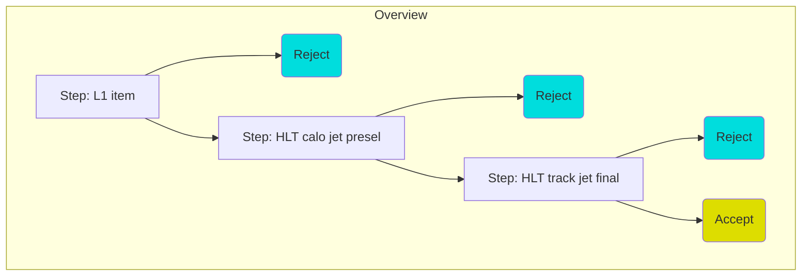
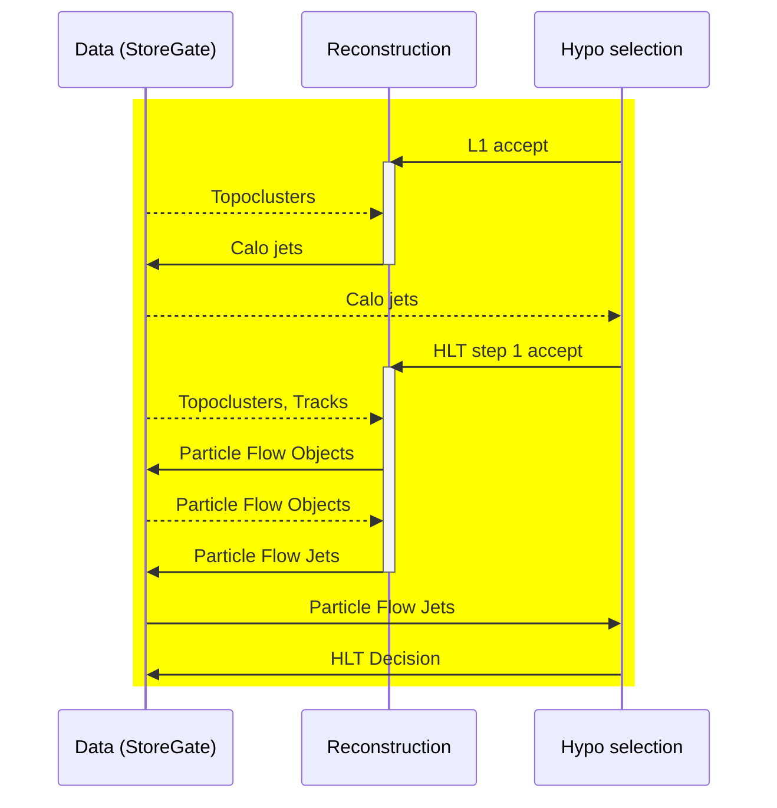
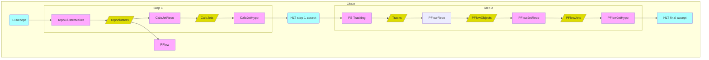

Jet Trigger Configuration Overview
=====

Trigger chains are structured as a series of *steps*, where each step can contain *reconstruction* & *hypothesis* elements, so as to allow for early rejection of uninteresting events.

A typical jet trigger chain may look like:

Each of the steps will contain a reconstruction sequence, responsible for generating the objects to be selected on, and a `HypoAlg` that reads the created (jet) collection. The `HypoAlg` will contain one or more `HypoTools`, each of which represents a different selection. Jet `HypoTools`  receive all jets in the event, and then apply a selection, which may be on individual jets or on groups of jets, unlike most other trigger signatures, in which objects are always selected on independently and then potentially combined.

Algorithms & data
-----

One way to envision the decision process is as an interaction between data and algorithms:

In this (simplified) picture, the HLT chain is implemented as repeated interactions of the form:
* Upstream hypo decision unlocks step reconstruction
* Reconstruction reads data from StoreGate, and adds new object collections
* Hypo reads the collections produced by Reco and decides whether to accept the event for the next step.
The final step accept causes the event to be written out.

Multithreaded algorithm scheduling
-----

Although simple to understand, this linear picture may be misleading. Because the Run 3 ATLAS software runs multithreaded, many algorithms can run in parallel, accessing different pieces of the event data. Therefore, scheduling the reco & hypo algorithms is done based on data dependencies. That is, each algorithm specifies its inputs and outputs. This allows the *scheduler* to figure out when any given algorithm should run.

The scheduler creates a graph showing how the algorithmic flow would proceed for one chain:

The step decisions function as gates which enable the succeeding algorithms to be activated, and within each subgraph, the availability of one algorithm allows the next to be run.

However, it is more interesting to consider what happens when we have many chains in parallel, e.g. some running only calo reco, some using large-radius jets and others running small-radius jets. This could expand to a situation like the following:

```mermaid
graph TD;

 subgraph Jet slice

  Start --> L1A(L1Accept A):::decision
  Start --> L1B(L1Accept B):::decision
  Start --> L1C(L1Accept C):::decision
  
  L1A --> Filter1a:::filter
  L1B --> Filter1b:::filter
  L1C --> Filter1a:::filter
  
  subgraph Step 1

    Filter1a -.->|activates| TopoClusterMaker
    Filter1b -.->|activates| TopoClusterMaker

    Filter1a -.->|activates| CaloJetRecoA4
    Filter1b -.->|activates| CaloJetRecoA10


    TopoClusterMaker:::alg --> Topoclusters[/Topoclusters/]:::data
    Topoclusters --> CaloJetRecoA4:::alg
    Topoclusters --> CaloJetRecoA10:::alg

    CaloJetRecoA4 --> AntiKt4CaloJets[/AntiKt4CaloJets/]:::data
    AntiKt4CaloJets --> CaloJetHypoA4:::alg
    CaloJetRecoA10 --> AntiKt10CaloJets[/AntiKt10CaloJets/]:::data
    AntiKt10CaloJets --> CaloJetHypoA10:::alg

  end 

  CaloJetHypoA4 --> HLT1A(HLT step 1 accept A):::decision
  CaloJetHypoA10 --> HLT1B(HLT step 1 accept B):::decision
  CaloJetHypoA4 --> HLT1C(HLT final accept C):::decision

  
  Topoclusters --> PFlow:::alg
  
  HLT1A --> Filter2a:::filter
  HLT1B --> Filter2b:::filter

  subgraph Step 2

    Filter2a -.->|activates| FSTrk[FS Tracking]:::alg
    Filter2a -.->|activates| PFlowJetRecoA4

    Filter2b -.->|activates| FSTrk
    Filter2b -.->|activates| PFlowJetRecoA10

    FSTrk --> Tracks:::data
    Tracks --> PFlowReco
  
    PFlowReco --> PFOs[/PFlowObjects/]:::data
    PFOs --> PFlowJetRecoA4:::alg
    PFOs --> PFlowJetRecoA10:::alg

    PFlowJetRecoA4 --> AntiKt4PFlowJets[/AntiKt4PFlowJets/]:::data
    AntiKt4PFlowJets --> PFlowJetHypoA4:::alg  

    PFlowJetRecoA10 --> AntiKt10PFlowJets[/AntiKt10PFlowJets/]:::data
    AntiKt10PFlowJets --> PFlowJetHypoA10:::alg 

  end
  
  PFlowJetHypoA4 --> HLT2A(HLT final accept A):::decision
  PFlowJetHypoA10 --> HLT2B(HLT final accept B):::decision

  end

  classDef data fill:#dd0;
  classDef alg fill:#faf;
  classDef filter fill:#bdb;
  classDef decision fill:#aff;
```

This is not an exact description, but it illustrates a few important points:
* Filters unlock segments of the execution graph.
* Data may be used multiple times by different parts of the reconstruction.
* Algorithms can run as soon as (but only when) all of their input data become available.

With this big picture in mind, the following links describe further details of the HLT jet python configuration:
* [ModuleOverview.md](./docs/ModuleOverview.md) -- Overview of what each python module does
* [Jet section in SignatureDicts.py](../Menu/SignatureDicts.py#L99-168) -- Annotation of jet `chainParts` in SignatureDicts module
